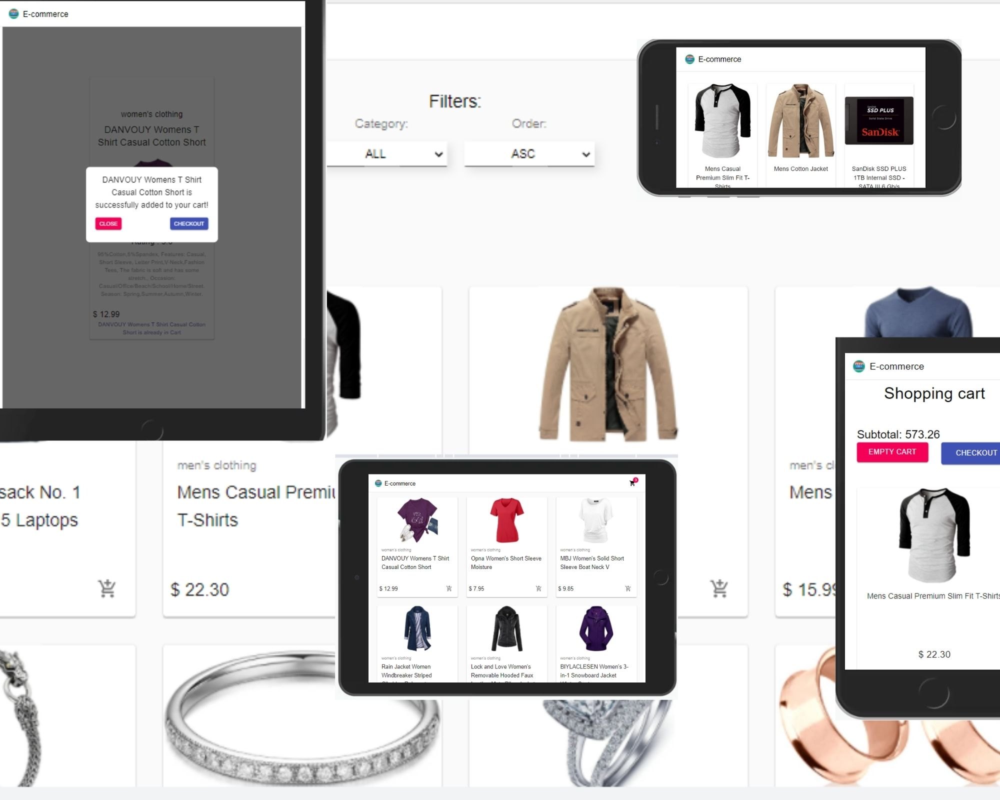
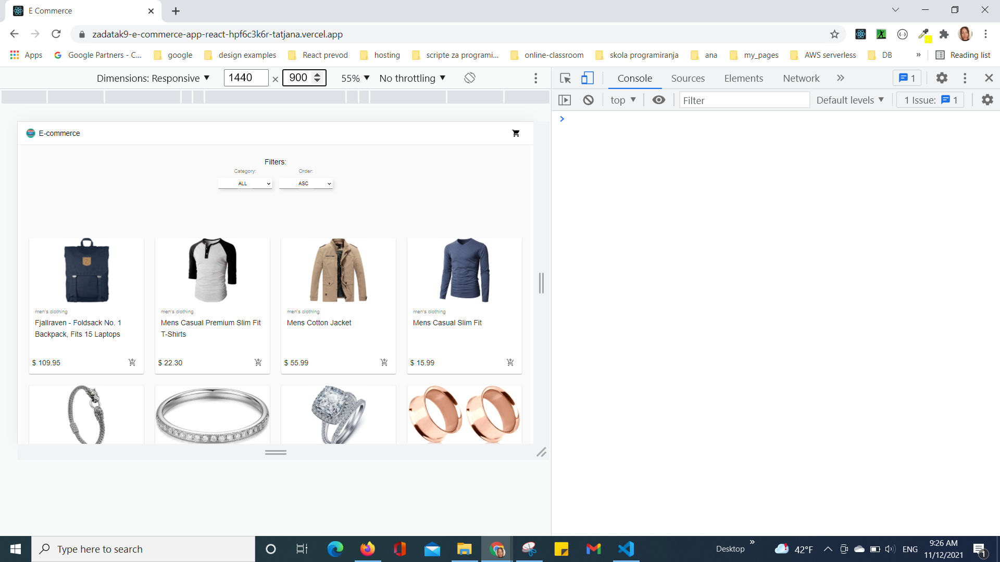
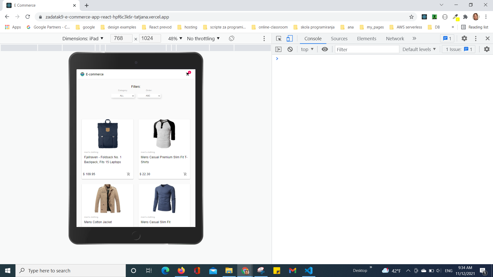
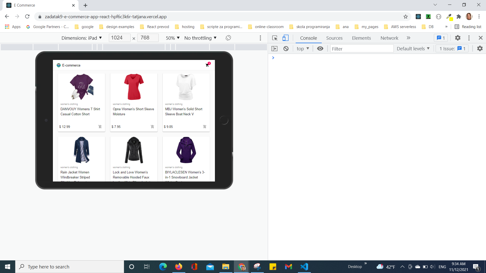
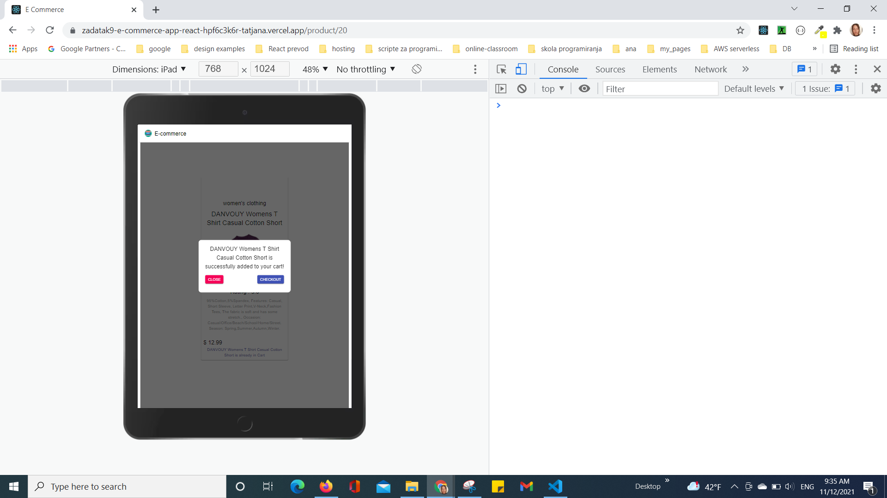
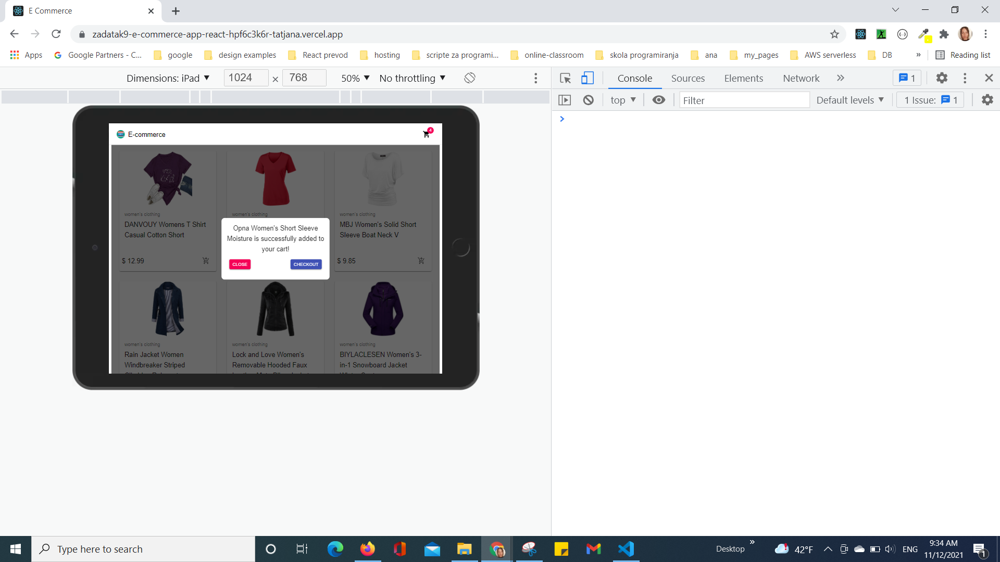
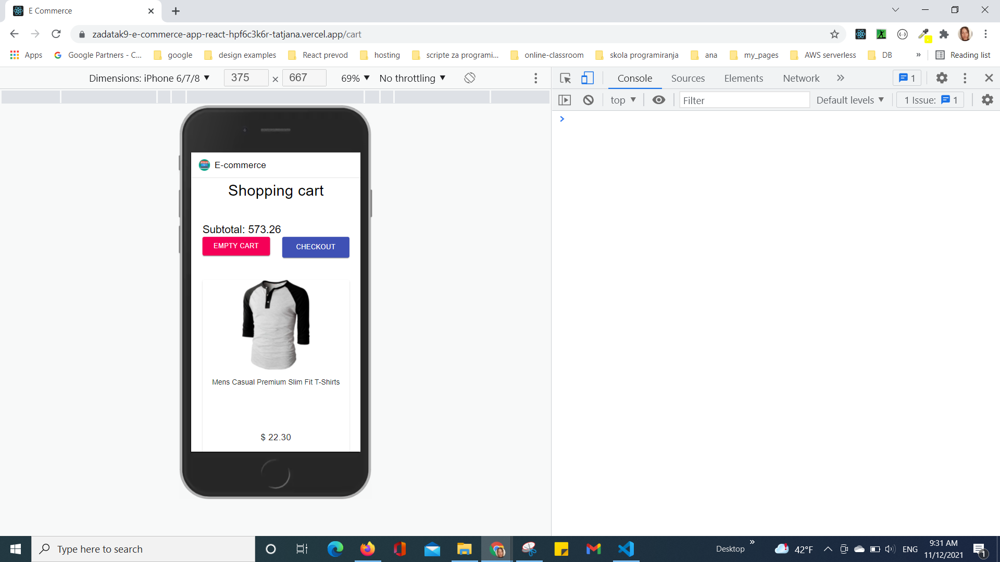
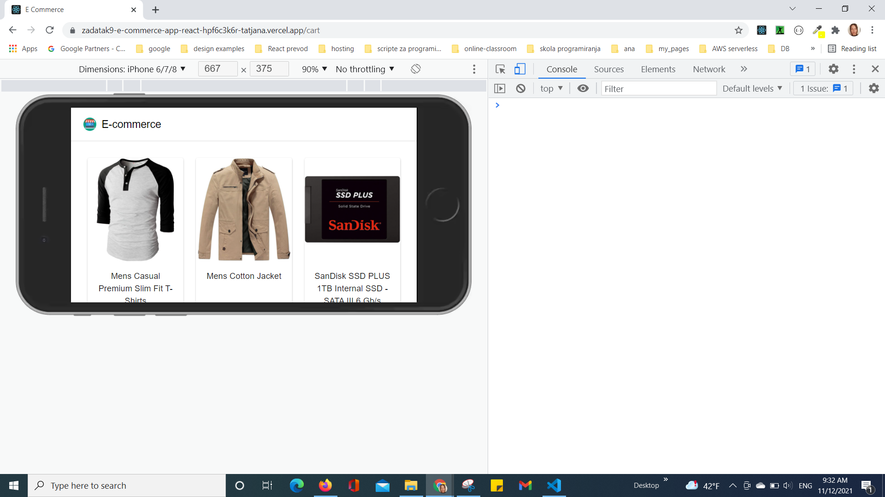
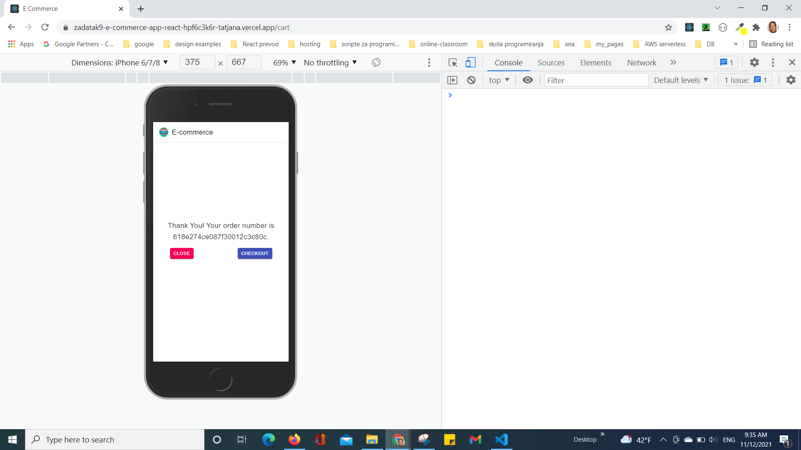

# Tatjana Marković E commerce React app solution

## Table of contents

  - [Overview](#overview)
  - [The challenge](#the-challenge)
  - [Screenshot](#screenshot)
  - [Links](#links)
  - [My process](#my-process)
  - [Built with](#built-with)
  - [Author](#author)

## Overview

- On first load
  1. Load store with products from  https://fakestoreapi.com/
  2. Load category list from https://fakestoreapi.com/
  3. Create cart

- On refresh: 
  1. Cart is saved in Local Storage and will be automatically loaded

- On check out:
    1. Cart is POST ed to https://fakestoreapi.com
    2. Response from https://fakestoreapi.com/ is returned and will be display to user as order id
    3. Cart is empty

- User can:
    1. See All products from store 
    2. Filter products by category and 
    3. See Single Product Detail, price, description, rating...
    4. Put product in cart
    5. See cart with choose products, quantity, single price and subtotal
    6. Update quantity in cart
    7. Remove product from cart
    8. Empty cart
    9. Sent order to back API
    10. Receive feedback from https://fakestoreapi.com/ with order id (number)  
### The challenge

It is necessary to create a mini eCommerce site using React and https://fakestoreapi.com/
### Screenshot

### Links

- Solution URL: [GitHub](https://github.com/tatjama/zadatak9-e-commerce-app-react/tree/develop)
- Preview: [Vercel](https://zadatak9-e-commerce-app-react-hpf6c3k6r-tatjana.vercel.app/)
- Live Site URL: [Vercel](https://zadatak9-e-commerce-app-react.vercel.app/)

## My process

1. Create a new project with [Create React App](https://github.com/facebook/create-react-app).
2. Initializing git repositories main and develop
3. Import git repositories to the Vercel project
4. Create React Components
5. import npm Material UI
6. Style for Desktop 
7. Responsive Mobile and Tablet style
8. Create Navigation
9. Create Hooks
10. Create Error Handler
11. Manual Test for bugs
12. Create screenshots
13. Change README-template.md to README.md
14. Open Pull request
15. Solve Issue
16. Merge develop branch into master branch
### Built with

1. React.js
2. Material design
3. CSS custom properties
4. localStorage
5. fakeStoreAPI
## Author

- Website - [Tatjana Markovic](https://my-react-portfolio-tatjana.vercel.app/)
- LinkedIn - [Tatjana Marković](https://www.linkedin.com/in/tatjana-markovi%C4%87-919501189/)
- GitHub - [tatjama](https://github.com/tatjama)

